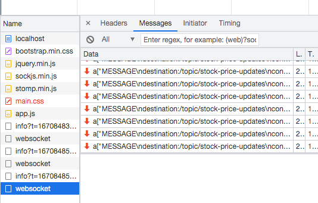

# Getting Started

* WebSocket is a thin, lightweight layer above TCP. This makes it suitable for using “subprotocols” to embed messages.
* STOMP (Simple text-oriented messaging protocol) is a subprotocol operating on top of the lower-level WebSocket. Stomp messages publish a JSON response
  e.g. {"symbolOnePrice":"9706.65","symbolTwoPrice":"9723.94"}
* Create a Spring POJO model viz. com.svb.springbootwebsocketdemo.model.StockPrice to resemble the Stomp message
* Create a WebSocketConfig to define the Websocket connection endpoint and topic  prefixes 
* Create a Spring Scheduler Configuration(com.svb.springbootwebsocketdemo.config.BlotterUpdatesSchedulerConfig) to periodically publish the updates to the websocket topic
* Implement the client (app.js) to subscribe to the websocket topic and render
* Chrome inspect view to debug the websocket connection

* Launch http://localhost:8091/ for a demo

## Guides
The following guides illustrate how to use some features concretely:

* [Using WebSocket to build an interactive web application](https://spring.io/guides/gs/messaging-stomp-websocket/)

